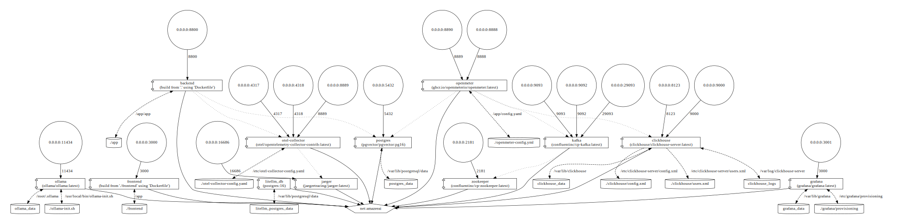
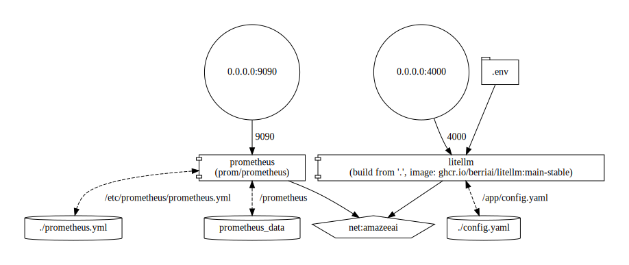

# amazee.ai

This repository contains the backend and frontend services for the amazee.ai application. The project is built using a modern tech stack including Python FastAPI for the backend, Next.js with TypeScript for the frontend, and PostgreSQL for the database.

## 🚀 Tech Stack

- **Backend**: Python FastAPI
- **Frontend**: Next.js + TypeScript
- **Database**: PostgreSQL
- **Testing**: Pytest (backend), Jest (frontend)
- **Containerization**: Docker & Docker Compose

## 📋 Prerequisites

- Docker and Docker Compose
- Make (for running convenience commands)
- Node.js and npm (for local frontend development)
- Python 3.x (for local backend development)

## 🛠️ Setup & Installation
**Specific to the `litellm-integrations` branch**

In order to have a complete experience, we need to have two repos with their independent docker-compose files running in parallel. To connect the two, we need a named network so that docker knows how to connect smoothly. To achieve this we run:
```bash
docker network create amazeeai
```
Then, in the `amazeeai` folder, we need to start up all the DBs, volumes, telemetry services, and the `amazeeai` backend and frontend services. This is straightforward, in the root of the folder run:
```bash
docker compose up -d
```
**If this is the first run** you may need to bootstrap some of the pieces. Once this is done the docker run will happen seamlessly.
```bash
cd frontend
npm run build
cd ../
python -m venv .venv
source .venv/bin/activate
pip install -r requirements.txt
pip install -r requirements-test.txt
```
Next, in the second repo, which is `litellm` (our fork of LiteLLM where we're doing what we need to), we are going to start up Prometheus and LiteLLM. First checkout the telemetry branch `git checkout dev/amazeeai-telemetry` then use compose to start up the services.
```bash
docker compose up -d
```
**On first run** you will need to do a full build in order to have all components available. add the `--build` flag to your compose command once only. LiteLLM takes a while for a full build and does not have hot-reloading configured yet.

What it looks like:


These two graphs connect on the custom external network named `amazeeai`, which allows the single Prometheus instance to scrape any and all backend services, and allows LiteLLM to pass through to Ollama, make use of the amzeeai postgres to store keys, and publish meter events to OpenMeter.

## 🧪 Running Tests

### Backend Tests
```bash
make backend-test     # Run backend tests
make backend-test-cov # Run backend tests with coverage report
```

### Frontend Tests
```bash
make frontend-test    # Run frontend tests
```

### All Tests
```bash
make test-all        # Run both backend and frontend tests
```

### Cleanup
```bash
make test-clean      # Clean up test containers and images
```

## 🧹 Cleanup

To clean up test containers and images:
```bash
make test-clean
```

## 🚀 Local Development

1. Start all services in development mode:
   ```bash
   docker-compose up -d
   ```

2. View logs for all services:
   ```bash
   docker-compose logs -f
   ```

3. View logs for a specific service:
   ```bash
   docker-compose logs -f [service]  # e.g. frontend, backend, postgres
   ```

4. Restart a specific service:
   ```bash
   docker-compose restart [service]
   ```

5. Stop all services:
   ```bash
   docker-compose down
   ```

The development environment includes:
- Hot reloading for frontend (Next.js) on port 3000
- Hot reloading for backend (Python) on port 8800
- PostgreSQL database on port 5432

Access the services at:
- Frontend: http://localhost:3000
- Backend API: http://localhost:8800


## 📁 Project Structure

```
.
├── app/                    # Backend Python code
├── frontend/              # React frontend application
├── tests/                 # Backend tests
├── scripts/               # Utility scripts
├── docker-compose.yml     # Docker services configuration
├── Dockerfile            # Backend service Dockerfile
├── Dockerfile.test       # Test environment Dockerfile
└── Makefile             # Development and test commands
```

## 🔑 Environment Variables

### Backend
- `DATABASE_URL`: PostgreSQL connection string
- `SECRET_KEY`: Application secret key

### Frontend
- `NEXT_PUBLIC_API_URL`: Backend API URL

## 👥 Contributing

1. Create a new branch for your feature
2. Make your changes
3. Run the test suite
4. Submit a pull request

## 📄 License

This project is licensed under the Apache License, Version 2.0 - see below for details:

```
Copyright 2024 amazee.io

Licensed under the Apache License, Version 2.0 (the "License");
you may not use this file except in compliance with the License.
You may obtain a copy of the License at

    http://www.apache.org/licenses/LICENSE-2.0

Unless required by applicable law or agreed to in writing, software
distributed under the License is distributed on an "AS IS" BASIS,
WITHOUT WARRANTIES OR CONDITIONS OF ANY KIND, either express or implied.
See the License for the specific language governing permissions and
limitations under the License.
```

For the full license text, please see [http://www.apache.org/licenses/LICENSE-2.0](http://www.apache.org/licenses/LICENSE-2.0)