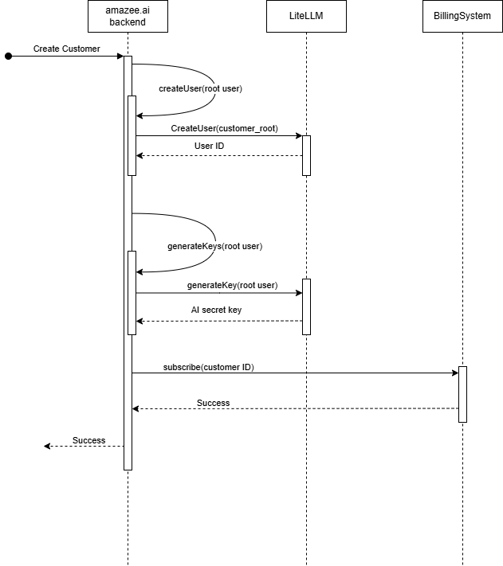

# amazee.ai User Management

In order to allow more complex use cases than the free-trial of Drupal AI, the amazee.ai system needs to be able to track a hierarchy of different users and roles, as well as group users within that hierarchy. This hierarchy will allow customers to manage resources in a manner appropriate to their internal structure and site structure, as well as providing the means by which usage will be metered and billed from amazee.ai. The hierarchy will integrate with LiteLLM as well as the chosen billing system, making the process of metering usage and charging customers easy for amazee.ai.
## Current Status
At time of writing, user management is handled entirely in the amazee.ai backend, and there are only two roles. A standard user, and an administrator. Either role can create and manage their own AI keys, but an administrator can manage keys on behalf of other users, as well as register regions and manage users.
Private AI Keys in amazee.ai are formed of two separate sets of credentials. One is the token used for authentication and authorisation with LiteLLM, the other is a link to a vector database, as well as a generated username and password for interaction with that DB. When the AI Key is created in LiteLLM, it is not associated with any specific user, usage is attributed via the key alias, which is not propagated to any billing systems by default.
## Out of Scope
- This document deals only with management of users and AI keys, it does not go into the management of vector database credentials or connections.
- This document proposes a variety of roles a user may be assigned. These are included to allow for extensibility of the user management system, and not because they are critical to the hierarchy.
- This document is intended to be agnostic of the billing system chosen for usage based metering. Whilst user management is important for that integration, the precise system used should not matter.
- This document mentions the concept of rules and restrictions which might be placed on a user, without defining how those are enforced, or what those rules might be.
## Proposed Entities
For a full set of personas and roles, see [[#Appendix A - Personas]]. In brief, there will be a hierarchy of entities. At each level the set of management permissions is further restricted, until the only possible action is making LiteLLM calls with a key. Starting from an `Administrator` which is an operational user in amazee.io, then we have a `Customer` who is a top level entity, responsible for paying bills. Customers will have `User`s with individual AI keys, as well as shared service AI keys not associated with a particular user.


## Integration Points
There are three key systems which need to integrate for user management to be effective. The entry point into these systems is amazee.ai where users are created and managed. In [[#Appendix A - Personas]] we define some of the entities which would be managed in amazee.ai. The second system is LiteLLM. LiteLLM already has the concept of users, with different roles. Users in LiteLLM can be members of Teams (groups of users) and Organisations (an enterprise feature). The different entities in LiteLLM are used in the integration with reporting systems, and are used to set key data in our third important system. The billing system must have an entity associated with every event, this entity is used to roll up usage via metering, subscriptions, etc.
LiteLLM uses the `team_id`, `user_id`, or `end_user_id` based on the associations made with the AI key used in the request, a well as data passed into the original request to set the customer or subject on the billing event. See [[#LiteLLM Lago `charge_by`]] for an example of how the decision is made for LiteLLM to roll up metering events.
## Implementation
The ideal implementation of this system is secure, simple, and scalable. Every entity has several key attributes which must be modelled and saved. Entity relations must be modelled and saved. It may make sense for a set of attributes to be shared between different entities, in this case we abstract only when necessary to maintain simplicity of the system.
### APIs
Each entity (Administrator, Customer, Team, User, AIKey) will need a full set of CRUD APIs. The full list of APIs is defined in [[#Appendix D - APIs]]
- **AuthZ note:** Administrators will be allowed to perform actions on Customer resources for operational purposes. The backend will be instrumented in such a way that these actions are trackable for reporting purposes.
- **AuthN note:** Unless otherwise specified all AuthN happens via API Key (Bearer Auth). Login is managed via basic auth (username and password). Future integrations for SSO, OAuth, etc are still possible via this method.
### Storage
##### Option 1: Tables in the existing Postgres database
None of the entity relationships required force a decision on the relational/non-relational DB. Given that there is already a rudimentary user management database in place, with infrastructure etc, reusing the existing database makes sense. The use of SQLAlchemy as a default ORM maintains simplicity without compromising security.
The only question is one of scalability. The user management system is intended to be low traffic, mostly serving to keep track of keys and users. High traffic usage will be direct to LiteLLM in-region and to the related billing system. Neither of these systems will call back into amazee.ai. Additionally, Postgres has the ability to scale both vertically and horizontally. Meaning as a solution it is very viable.
##### Option 2: New non-relational datastore; either local or cloud based
A non-relational datastore has very high scalability by default, but may add additional complexity to a system which is relational by nature. Security is neither better nor worse with a non-relational datastore.
### Integrations
- When a key is created, the `team_id` and `user_id` fields must be set in LiteLLM, this will allow those fields to be used in the billing events, tying usage to a customer. `user_id` is not required to relate to an existing user in liteLLM, the same for `team_id` although certain aspects are more user friendly if the `team` has been created.
- A single customer would need to map to a single `team` across _all_ instances of LiteLLM for simplicity. Billing should be aggregated in the billing system of choice.

---
## Appendices
### Appendix A - Personas
#### Administrator
An entity outside of the billing flow who is responsible for managing the other personas, either directly or indirectly. The administrator sets up subscriptions, meters, and billable events. They define regions and maintain the LiteLLM proxy.
#### Customer
The entity responsible for the payment of bills and/or invoices. Every call to the downstream LLM **MUST** include a reference (either direct or indirect) to the `customer_id` so that subscriptions and meters can be correctly referenced.
A customer with no associated Private AI Keys cannot incur a bill (as they cannot make authenticated LLM calls). As such there is no need for the customer to be associated with a region until such time as a key is created.
#### ~~Team~~
~~A group of users within the scope of a single customer. These users have common permissions, a shared (or common?) budget, and generate a billing/usage report which is a portion of the total customer bill. A user may be a member of multiple teams, but then calls to the downstream LLM **MUST** reference the team directly for correct flow of billing data (or risk the same usage being metered twice). A team lead may have many teams, and a team may have multiple leads.~~
#### User
An entity making LLM calls via DrupalAI or some other interface. Every user **MUST** be associated with a Customer, in order to roll up usage and billing correctly. Every customer has a default user (`customer_root`) which can be used without any new users being created. One customer may have many users, but each user must have _exactly_ one customer.
An amazee.ai user may or may not be associated with a human user. Contact details may be shared between users.
A user may have one of the following roles.
##### Team Lead/Administrator
A team lead has the ability to manage other users, view billing and usage details, and assign limits within the constraints of the customer. A team lead may have management permissions over _all_ users, or _some_ users, as defined by the customer. Groups of users manged by a team lead are called a Team.
##### Key Creator
The Key Creator role allows a user to generate, modify, and delete private AI keys associated with their own user. They may view billing and usage reports associate with their own usage.
##### Read Only
The read only role allows a user to use keys which have been created on their behalf by a team lead, but they may not modify or delete the keys, and cannot generate new keys. They may view billing and usage reports associated with their own usage.
#### Private AI Key
The 'entity' which has permissions to call LiteLLM and the underlying models. The `private_ai_key` is used for both AuthN and AuthZ when calling through to the LLMs. Every call to LiteLLM **MUST** include a `private_ai_key`. A user may have any number of keys, but every key must be associated with _exactly_ one user. A `private_ai_key` **MAY** suffice as indirect reference to a `customer_id` for billing systems. There will be two types of AI keys:
##### Individual AI Key
This is an AI key associated directly with a User. It may only be used by the associated User, and all usage will be attributed to that user. Costs will be attributed to the customer the user is associated with.
##### Service AI Key
This is an AI key associated with the top level Customer entity. This key may be used by any entity under the banner of the customer for making LLM calls, and usage will be attributed to the key. Costs will still be attributed to the customer.
### Appendix B - Documentation
##### [LiteLLM key generation](https://litellm-api.up.railway.app/#/key%20management/generate_key_fn_key_generate_post)
```json
{
  "key_alias": "string",
  "duration": "string",
  "models": [],
  "spend": 0,
  "max_budget": 0,
  "user_id": "string",
  "team_id": "string",
  "max_parallel_requests": 0,
  "metadata": {},
  "tpm_limit": 0,
  "rpm_limit": 0,
  "budget_duration": "string",
  "allowed_cache_controls": [],
  "config": {},
  "permissions": {},
  "model_max_budget": {},
  "model_rpm_limit": {},
  "model_tpm_limit": {},
  "guardrails": [
    "string"
  ],
  "blocked": true,
  "aliases": {},
  "key": "string",
  "budget_id": "string",
  "tags": [
    "string"
  ],
  "enforced_params": [
    "string"
  ],
  "soft_budget": 0,
  "send_invite_email": true
}
```

##### [LiteLLM Completion](https://docs.litellm.ai/docs/completion/input#input-params-1)
```python
def completion(
    model: str,
    messages: List = [],
    # Optional OpenAI params
    timeout: Optional[Union[float, int]] = None,
    temperature: Optional[float] = None,
    top_p: Optional[float] = None,
    n: Optional[int] = None,
    stream: Optional[bool] = None,
    stream_options: Optional[dict] = None,
    stop=None,
    max_completion_tokens: Optional[int] = None,
    max_tokens: Optional[int] = None,
    presence_penalty: Optional[float] = None,
    frequency_penalty: Optional[float] = None,
    logit_bias: Optional[dict] = None,
    user: Optional[str] = None,
    # openai v1.0+ new params
    response_format: Optional[dict] = None,
    seed: Optional[int] = None,
    tools: Optional[List] = None,
    tool_choice: Optional[str] = None,
    parallel_tool_calls: Optional[bool] = None,
    logprobs: Optional[bool] = None,
    top_logprobs: Optional[int] = None,
    deployment_id=None,
    # soon to be deprecated params by OpenAI
    functions: Optional[List] = None,
    function_call: Optional[str] = None,
    # set api_base, api_version, api_key
    base_url: Optional[str] = None,
    api_version: Optional[str] = None,
    api_key: Optional[str] = None,
    model_list: Optional[list] = None,  # pass in a list of api_base,keys, etc.
    # Optional liteLLM function params
    **kwargs,

) -> ModelResponse:
```

##### LiteLLM Lago `charge_by`
```python
charge_by: Literal["end_user_id", "team_id", "user_id"] = "end_user_id"
external_customer_id: Optional[str] = None

if os.getenv("LAGO_API_CHARGE_BY", None) is not None and isinstance(
    os.environ["LAGO_API_CHARGE_BY"], str
):
    if os.environ["LAGO_API_CHARGE_BY"] in [
        "end_user_id",
        "user_id",
        "team_id",
    ]:
        charge_by = os.environ["LAGO_API_CHARGE_BY"]  # type: ignore
    else:
        raise Exception("invalid LAGO_API_CHARGE_BY set")

if charge_by == "end_user_id":
    external_customer_id = end_user_id
elif charge_by == "team_id":
    external_customer_id = team_id
elif charge_by == "user_id":
    external_customer_id = user_id
```

Results in an event like:
```json
 {
      "lago_id": "9a86ab1d-3e10-4be0-8e48-4874355ac21d",
      "transaction_id": "efdf4bab-c742-4726-8a9b-85b08d87aa31",
      "lago_customer_id": null,
      "code": "llm-event",
      "timestamp": "2025-04-11T09:38:55.687Z",
      "precise_total_amount_cents": null,
      "properties": {
        "model": "llama3.2",
        "total_tokens": 73,
        "prompt_tokens": 37,
        "response_cost": null,
        "completion_tokens": 36
      },
      "lago_subscription_id": null,
      "external_subscription_id": "DEV",
      "created_at": "2025-04-11T09:38:55Z"
    },
```
### Appendix C - Sequence Diagrams
#### Customer Registration



#### Create *


#### Required Objects
##### Customer / Organisation
- Contact Details
- Name
- Unique ID (generated)
- Billing Details
- Budgets and Rules
- Subscriptions and Payment Plans
##### Team / Group
- Name
- Unique ID (generated)
- Budgets and Rules (inherit from [[#Customer / Organisation]])
- Customer (Parent)
- Members (user IDs)
##### User
- Contact Details (?)
- Name
- Unique ID (generated)
- AI Keys
- Vector DB Credentials
- Budgets and Rules (inherit from [[#Customer / Organisation]] and [[#Team / Group]])
- Customer (Parent)
- Teams
- Role
#### Persona Relations


### Appendix D - APIs
##### Administrators:
- `CreateAdministrator`
	- AuthZ: Action can only be performed by an Administrator
	- AuthN: API Key as saved in the system must be a match (bearer auth)
	- Fields: email, password
- `GetAdministrator`, `ListAdministrators`
	- AuthZ: Action can only be performed by an Administrator
	- AuthN: API Key
	- Fields: `Get` - email/ID
- `UpdateAdministrator`
	- AuthZ: Action can only be performed by an Administrator.
	- AuthN: API Key
	- Fields: email, password
- `DeleteAdministrator`
	- AuthZ: Action can only be performed by an Administrator
	- AuthN: API Key
	- Fields: ID
##### Customers:
- `RegisterCustomer`
	- AuthZ: Any internet user may perform this action.
	- AuthN: Provided email will be verified via link.
	- Fields: email, phone, billing address, root password,
- `GetCustomer`
	- AuthZ: An Administrator, or the customer referenced
		- Regardless of whether the requested customer exists or not, if the caller is not an administrator nor the requested customer the response must be 403 - Unauthorised
	- AuthN: API Key
	- Fields: email/ID
- `ListCustomers`
	- AuthZ: Administrators only
	- AuthN: API Key
	- Fields: optional filters, pagination
- `UpdateCustomer`
	- AuthZ: An administrator or the referenced customer
		- Regardless of whether the requested customer exists or not, if the caller is not an administrator nor the requested customer the response must be 403 - Unauthorised
	- AuthN: API Key
	- Fields: ID, email, phone, billing address, root password, budgets, payment method, subscription
- `DeleteCustomer`
	- AuthZ: Administrators only
	- AuthN: API Key
	- Fields: ID
##### Teams:
- `CreateTeam`
	- AuthZ: Customer, User (role >= Team Lead)
	- Fields: Name, Budget, Rules
- `GetTeam`
	- Fields: Name/ID
- `ListTeams`
- `ListUsersForTeam`
	- Fields: TeamName/TeamID
- `UpdateTeamDetails`
	- Fields: Name, Budget, Rules
- `AddUserToTeam`
	- Fields: TeamID, UserID
- `AddUsersToTeam`
	- Fields: TeamID, List(UserID)
- `RemoveUserFromTeam`
	- Fields: TeamID, UserID
- `DeleteTeam`
	- Fields TeamID
##### Users:
- `CreateUser`
	- AuthZ: Customer, User (role >= Team Lead)
- `GetUser`
	- AuthZ: Customer, User (role == Any)
- `ListUsers`
	- AuthZ: Customer, User (role >= Team Lead)
- `UpdateUserDetails`
	- AuthZ: Customer, User (role >= Team Lead), User (self)
- `DeleteUser`
	- AuthZ: Customer, User (role >= Team Lead)
##### AI Keys
AuthZ: Customer, User (role >= Key Creator)
- `GenerateKey`
- `GetKey`
- `ListKeysForUser`
- `ListKeysForTeam`
- `ListKeysForCustomer`
- `UpdateKey`
- `DeleteKey`