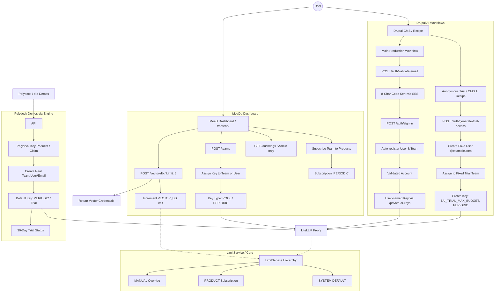

# amazee.ai Feature & Workflow Diagram

```mermaid
graph TD
    %% Entry Points
    User((User)) --> Drupal[Drupal CMS / Recipe]
    User --> Dashboard[MoaD Dashboard / frontend/]
    Polydock[Polydock / d.o Demos] --> API

    %% Drupal Workflows
    subgraph Drupal_Workflows [Drupal AI Workflows]
        Drupal --> Trial[Anonymous Trial / CMS AI Recipe]
        Drupal --> MainProd[Main Production Workflow]
        
        Trial --> GenTrialAPI[POST /auth/generate-trial-access]
        GenTrialAPI --> TrialUser[Create Fake User @example.com]
        TrialUser --> TrialTeam[Assign to Fixed Trial Team]
        TrialTeam --> TrialKey[Create Key: $AI_TRIAL_MAX_BUDGET, PERIODIC]
        
        MainProd --> EmailVal[POST /auth/validate-email]
        EmailVal --> CodeSent[8-Char Code Sent via SES]
        CodeSent --> SignIn[POST /auth/sign-in]
        SignIn --> AutoReg[Auto-register User & Team]
        AutoReg --> LinkedAccount[Validated Account]
        LinkedAccount --> CustomKey[User-named Key via /private-ai-keys]
    end

    %% Polydock Workflow
    subgraph Polydock_Workflow [Polydock Demos via Engine]
        API --> PolyReq[Polydock Key Request / Claim]
        PolyReq --> RealEntity[Create Real Team/User/Email]
        RealEntity --> DefaultKey[Default Key: PERIODIC / Trial]
        DefaultKey --> LifeSpan[30-Day Trial Status]
    end

    %% MoaD Dashboard
    subgraph Dashboard_Operations [MoaD / Dashboard]
        Dashboard --> ManCreate[POST /teams]
        Dashboard --> Subscribe[Subscribe Team to Products]
        Dashboard --> ViewAudit[GET /audit/logs / Admin only]
        Dashboard --> CreateVector[POST /vector-db / Limit: 5]
        ManCreate --> AssignKey[Assign Key to Team or User]
        AssignKey --> PoolKey[Key Type: POOL / PERIODIC]
        Subscribe --> SubscriptionLogic[Subscription: PERIODIC]
        CreateVector --> VectorEnforce[Increment VECTOR_DB limit]
    end

    %% Core Data
    TrialKey --> LiteLLM[LiteLLM Proxy]
    CustomKey --> LiteLLM
    DefaultKey --> LiteLLM
    PoolKey --> LiteLLM
    CreateVector --> VectorCreds[Return Vector Credentials]

    %% Limits & Defaults
    subgraph Limits_Enforcement [LimitService / Core]
        LimitCheck[LimitService Hierarchy]
        ManualLimit[MANUAL Override]
        ProductLimit[PRODUCT Subscription]
        DefaultLimit[SYSTEM DEFAULT]
        
        LimitCheck --> ManualLimit
        LimitCheck --> ProductLimit
        LimitCheck --> DefaultLimit
    end

    LiteLLM -.-> LimitCheck
    VectorEnforce -.-> LimitCheck
```
